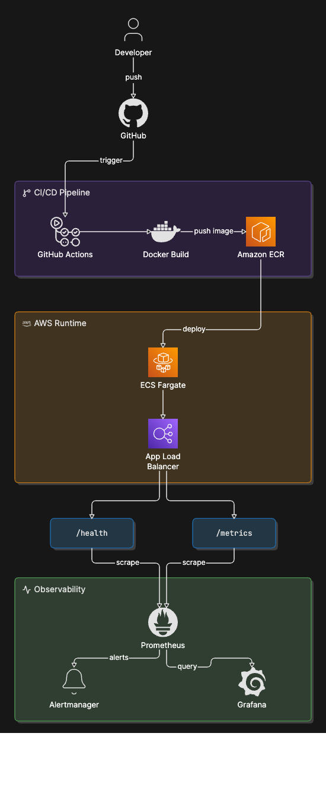
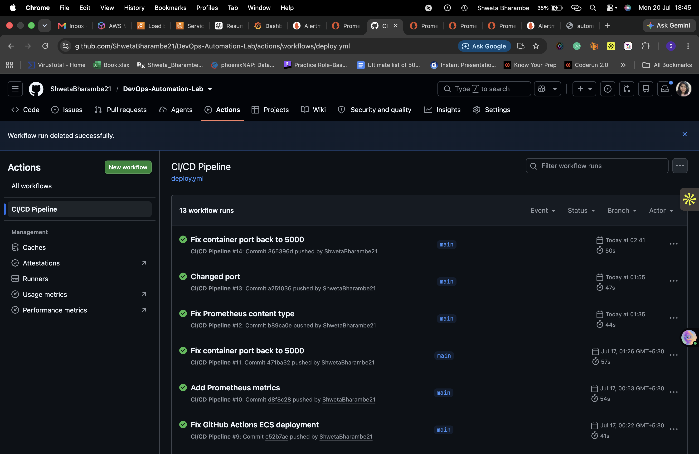
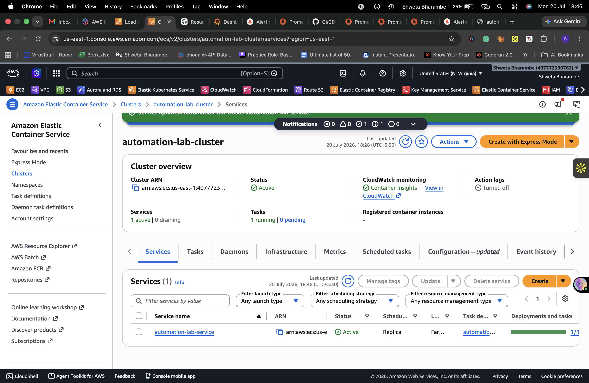
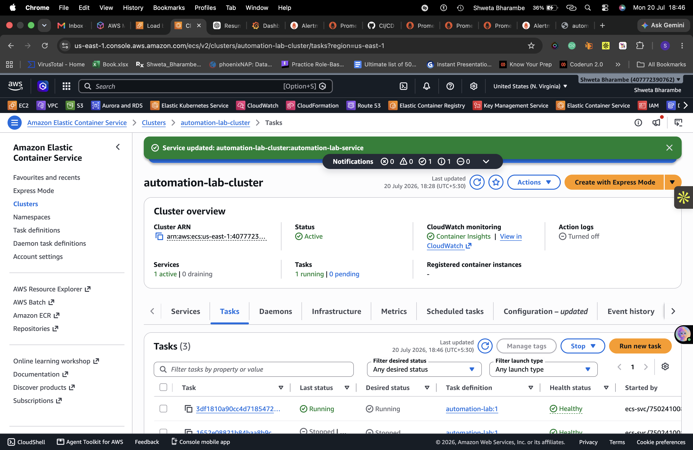
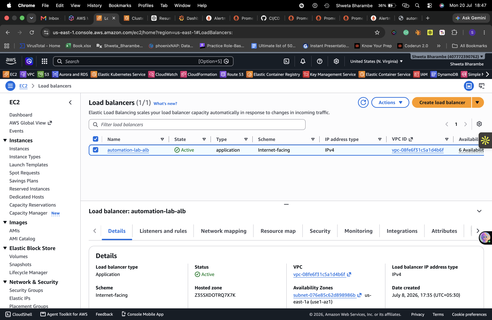
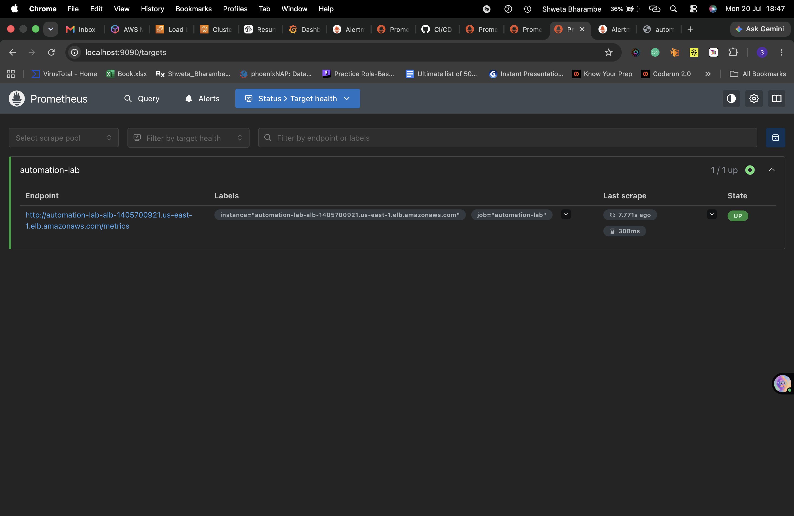
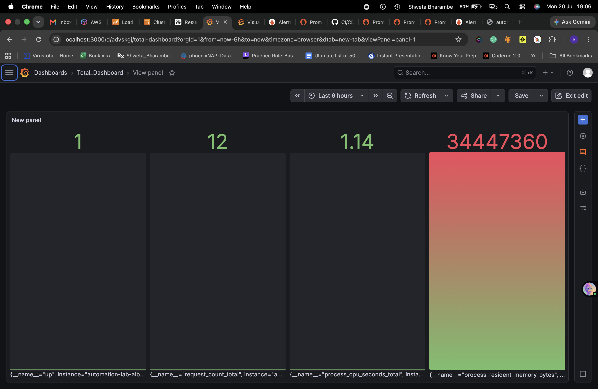
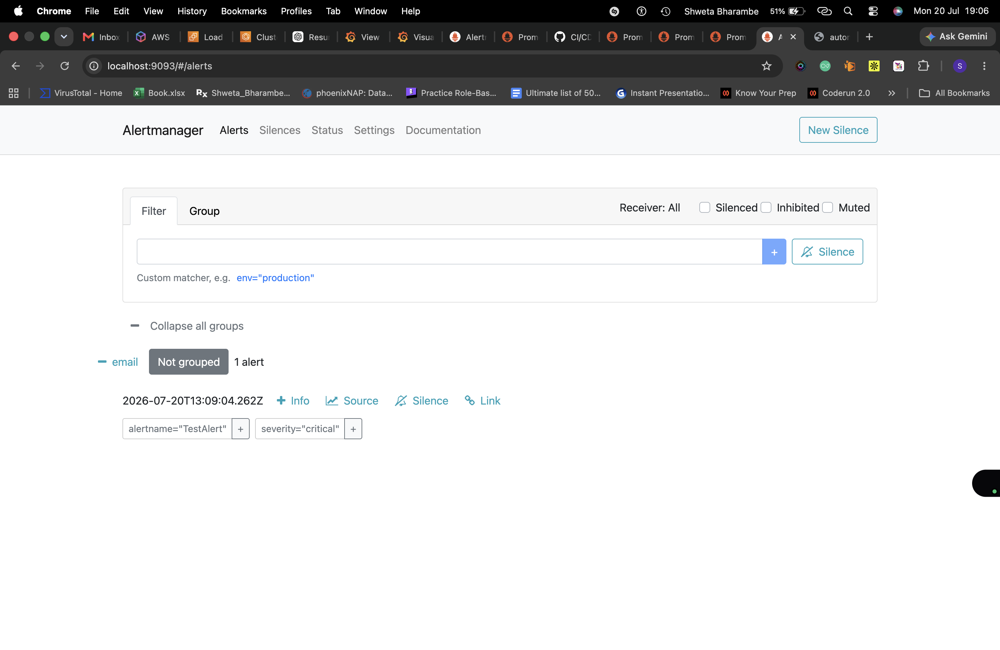
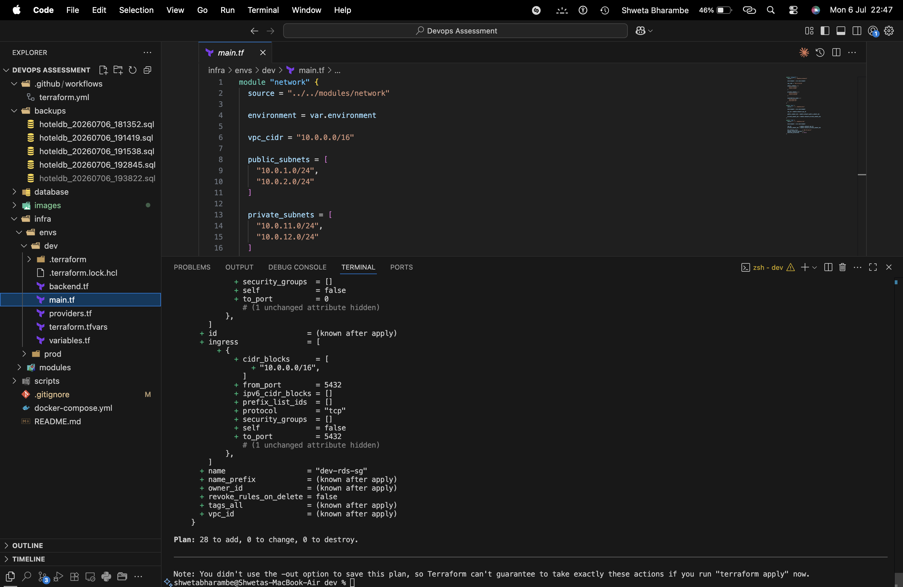

# DevOps-Automation-Lab
# 🚀 DevOps Automation Lab

A complete end-to-end DevOps project demonstrating Infrastructure as Code (IaC), CI/CD, containerization, cloud deployment, monitoring, visualization, and alerting on AWS.

This project automates the deployment of a containerized Flask application using **Terraform**, **Docker**, **GitHub Actions**, **Amazon ECS Fargate**, **Amazon ECR**, **Application Load Balancer**, **Prometheus**, **Grafana**, and **Alertmanager**.

---

# 📌 Project Overview

This project showcases a modern DevOps workflow by automating infrastructure provisioning, application deployment, monitoring, and alerting.

The Flask application is containerized using Docker, deployed on Amazon ECS Fargate, exposed through an Application Load Balancer, continuously deployed using GitHub Actions, monitored using Prometheus, visualized in Grafana, and configured with Alertmanager for automated email notifications.

---

# 🏗️ Architecture



---

# 📂 Project Structure

```
DevOps-Automation-Lab/
│
├── .github/
│   └── workflows/
│       └── deploy.yml
│
├── app/
│   ├── app.py
│   ├── Dockerfile
│   ├── requirements.txt
│   └── __init__.py
│
├── bootstrap/
│
├── terraform/
│   ├── alb.tf
│   ├── autoscaling.tf
│   ├── backend.tf
│   ├── ecr.tf
│   ├── ecs-cluster.tf
│   ├── ecs-service.tf
│   ├── iam.tf
│   ├── network.tf
│   ├── provider.tf
│   ├── security-group.tf
│   └── variables.tf
│
├── monitoring/
│   ├── prometheus.yml
│   ├── alerts.yml
│   ├── alertmanager.yml
│   └── docker-compose.yml
│
├── architecture/
│   └── architecture.png
│
├── screenshots/
│
├── tests/
│
└── README.md
```

---

# ⚙️ Tech Stack

| Category | Technology |
|------------|----------------|
| Cloud | AWS |
| Infrastructure as Code | Terraform |
| Containerization | Docker |
| Container Registry | Amazon ECR |
| Container Orchestration | Amazon ECS Fargate |
| Load Balancer | AWS Application Load Balancer |
| CI/CD | GitHub Actions |
| Monitoring | Prometheus |
| Visualization | Grafana |
| Alerting | Alertmanager |
| Backend | Python, Flask |
| Testing | PyTest |
| Version Control | Git & GitHub |

---

# ✨ Features

## Infrastructure as Code

- Provision AWS infrastructure using Terraform
- Custom VPC
- Public Subnets
- Internet Gateway
- Route Tables
- Security Groups
- Application Load Balancer
- ECS Cluster
- ECS Service
- Amazon ECR Repository

---

## Docker

- Dockerized Flask Application
- Lightweight Docker Image
- Containerized Deployment

---

## CI/CD Pipeline

- Automated testing using PyTest
- Automatic Docker image build
- Push Docker image to Amazon ECR
- Automatic ECS deployment
- GitHub Actions Workflow
- AWS Secrets integration

---

## AWS Deployment

- Amazon ECS Fargate
- Application Load Balancer
- Health Checks
- Automatic Task Replacement
- Highly Available Deployment

---

## Monitoring

Prometheus continuously monitors:

- Application Availability
- HTTP Request Count
- CPU Usage
- Memory Usage
- Process Metrics

---

## Grafana Dashboard

Dashboard includes:

- Application Status
- Request Count
- CPU Usage
- Memory Usage
- Request Rate
- Prometheus Health

---

## Alerting

Alertmanager sends notifications for:

- Application Down
- High CPU Usage
- High Memory Usage
- No Incoming Traffic

Email notifications are configured using Gmail SMTP.

---

# 🔄 CI/CD Workflow

```
Developer

        │

        ▼

Push to GitHub

        │

        ▼

GitHub Actions

        │

        ▼

Run Unit Tests

        │

        ▼

Build Docker Image

        │

        ▼

Push Image to Amazon ECR

        │

        ▼

Force ECS Deployment

        │

        ▼

Application Updated
```

---

# 📈 Monitoring Workflow

```
Flask Application

        │

        ▼

/metrics Endpoint

        │

        ▼

Prometheus

      ┌──────────────┐
      ▼              ▼

 Grafana      Alertmanager

                     │

                     ▼

              Email Notification
```

---

# 📡 Application Endpoints

| Endpoint | Description |
|------------|----------------|
| `/` | Home Page |
| `/health` | Health Check |
| `/metrics` | Prometheus Metrics |

---

# 🚨 Alert Rules

Configured alerts include:

- ApplicationDown
- HighCPUUsage
- HighMemoryUsage
- NoTraffic

---

# 📊 Screenshots

## GitHub Actions



---

## ECS Service



---

## ECS Tasks



---

## Application Load Balancer



---

## Prometheus Targets



---

## Grafana Dashboard



---

## Alertmanager



---

## Terraform Apply



---

# 🚀 Getting Started

## Clone Repository

```bash
git clone https://github.com/<your-username>/DevOps-Automation-Lab.git

cd DevOps-Automation-Lab
```

---

## Provision Infrastructure

```bash
cd terraform

terraform init

terraform plan

terraform apply
```

---

## Deploy Application

Push changes to the **main** branch.

GitHub Actions automatically:

- Runs Tests
- Builds Docker Image
- Pushes Image to ECR
- Deploys Application to ECS

---

## Run Monitoring Stack

```bash
cd monitoring

docker compose up -d
```

---

## Access Services

| Service | URL |
|------------|----------------|
| Application | http://<ALB-DNS> |
| Metrics | http://<ALB-DNS>/metrics |
| Prometheus | http://localhost:9090 |
| Grafana | http://localhost:3000 |
| Alertmanager | http://localhost:9093 |

---

# 🔒 Security

- IAM Roles
- GitHub Secrets
- Security Groups
- Least Privilege Access
- AWS Credential Management

---

# 📚 Learning Outcomes

Through this project, I gained hands-on experience with:

- Infrastructure as Code
- Cloud Deployment on AWS
- Docker Containerization
- CI/CD Automation
- Amazon ECS Fargate
- Amazon ECR
- Application Load Balancer
- Monitoring using Prometheus
- Dashboard creation in Grafana
- Alerting using Alertmanager
- GitHub Actions
- DevOps Best Practices

---

# 🔮 Future Improvements

- HTTPS using ACM
- Route53 Domain Integration
- ECS Auto Scaling
- Terraform Remote Backend (S3 + DynamoDB)
- AWS Secrets Manager
- Trivy Image Scanning
- SonarQube Code Analysis
- Blue-Green Deployment
- Slack Notifications
- AWS CloudWatch Integration

---

# 👩‍💻 Author

**Shweta Bharambe**

DevOps Engineer

- AWS
- Terraform
- Docker
- ECS
- GitHub Actions
- Prometheus
- Grafana
- Alertmanager
- Python
- Linux

---

⭐ If you found this project helpful, consider giving it a star!